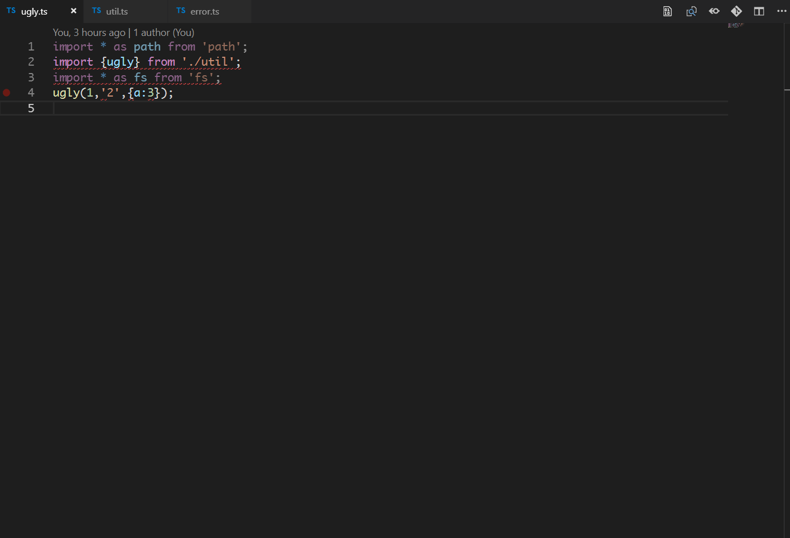

# tsfmt for Visual Studio Code
Format your TypeScript code with [tsfmt](https://github.com/vvakame/typescript-formatter).

## Requirements Resolution
This extension will use `tsfmt`, `tslint` and `typescript` modules installed closest to the formatted file. If any of the modules is not installed, a bundled version is used instead. The fallback `typescript` module is the version shipped with VSCode.

## Extension Settings
| Key | Type | Description | Default |
| --- | ---- | ----------- | ------- |
| tsfmt.configPath | `string \| null` | Path to `tsfmt.json`. If not specified, the one closest to the formatted file will be used | `null` |
| tsfmt.logLevel | `"error" \| "warning" \| "information"` | The verbosity of logging in the Output Panel. `error` < `warning` < `information` | `"error"` |
| tsfmt.notification | `"enabled" \| "disabled"` | Whether or not show notifications. This does not affect `tsfmt.logLevel` | `"enabled"` |
| tsfmt.tsconfig.configPath | `string \| null` | Path to `tsconfig.json`. If not specified, the one closest to the formatted file will be used | `null` |
| tsfmt.tslint.autoFix | `"enabled" \| "disabled"` | Fix all auto-fixable tslint failures after formatting | `"disabled"` |
| tsfmt.tslint.configPath | `string \| null` | Path to `tslint.json`. If not specified, the one closest to the formatted file will be used | `null` |

## License
This software is released under the terms of the MIT license.

## Release Notes
See [CHANGELOG.md](CHANGELOG.md) or the [Releases Page](https://github.com/EternalPhane/tsfmt-vscode/releases).
